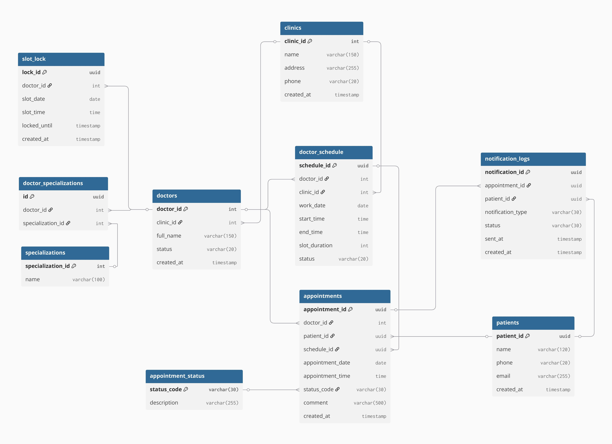

# Техническое задание: Модуль онлайн-записи пациента к врачу
## Глоссарий терминов
| Термин | Определение |
|--------|-------------|
| Пациент (Patient) | Пользователь клиники, который записывается на приём к врачу. Идентифицируется уникальным patient_id. |
| Врач (Doctor) | Медицинский специалист, принимающий пациентов. Идентифицируется doctor_id. Может иметь несколько специализаций и работать в одной или нескольких клиниках. |
| Клиника (Clinic) | Медицинское учреждение или филиал, в котором ведут приём врачи. Идентифицируется clinic_id. |
| Расписание врача (Doctor Schedule) | Данные о рабочих днях и часах работы врача. Используется для генерации доступных слотов для записи. |
| Слот (Slot) | Конкретный временной интервал приёма, доступный для записи пациента. Создаётся на основе расписания врача. |
| Запись на приём (Appointment) | Информация о назначенном визите пациента к врачу, включая дату, время, статус и комментарии. |
| Статус записи (Appointment Status) | Справочник состояний записи: PENDING, CONFIRMED, CANCELLED, COMPLETED, NO_SHOW. |
| Блокировка слота (Slot Lock) | Механизм предотвращения двойного бронирования одного слота при высокой нагрузке или параллельных запросах. |
| Уведомление (Notification) | Сообщение пациенту о записи или напоминание о предстоящем приёме. Логируется в notification_logs. |
| NFR (Non-Functional Requirement) | Нефункциональные требования, включая производительность, надёжность, масштабируемость, безопасность и удобство использования. |
| BDD (Behavior Driven Development) | Методология описания функциональности через сценарии, понятные бизнесу, разработчикам и тестировщикам, используя формат *Given/When/Then*. |
| User Story (Пользовательская история) | Краткое описание потребности пользователя в формате *Как…, Я хочу…, Чтобы…*. |
| Acceptance Criteria (Критерии приемки) | Условия, при которых функциональность считается реализованной и готовой к приёмке. |
| API (Application Programming Interface) | Набор REST эндпоинтов для взаимодействия клиентских приложений и сервисов с системой записи. |
| ER-диаграмма (Entity-Relationship Diagram) | Диаграмма, отображающая сущности системы и связи между ними. |
| Sequence Diagram (Диаграмма последовательности) | Показывает взаимодействие компонентов системы и поток данных при выполнении сценария. |
| BPMN (Business Process Model and Notation) | Стандарт для графического моделирования бизнес-процессов. |
| Architecture Diagram (C4 модель) | Схема архитектуры системы, показывающая компоненты, сервисы, базы данных и внешние интеграции. |

## Бизнес требования
### 1. Общее описание  
#### 1.1 Название проекта  
Разработка модуля онлайн-записи пациентов к врачу в медицинской информационной системе (МИС) клиники.
Модуль предназначен для обеспечения возможности пациентам самостоятельно записываться на приём к врачу через веб-интерфейс или мобильное приложение без участия администратора.

#### 1.2 Бизнес цели
**Основные цели внедрения модуля:**
 1. Снижение нагрузки на регистратуру  
 • уменьшение количества телефонных звонков  
 • сокращение времени обработки записи администраторами  
 2. Повышение доступности медицинских услуг  
 • возможность записи 24/7  
 • сокращение времени ожидания пациента  
 3. Оптимизация загрузки врачей  
 • равномерное распределение пациентов по расписанию  
 • уменьшение количества пустых слотов  
 4. Повышение удовлетворённости пациентов  
 • удобный интерфейс записи  
 • прозрачность доступных временных слотов  
 5. Повышение эффективности операционных процессов клиники  

#### 1.3 Целевая аудитория
**Основные пользователи:**  
**1.Пациенты**  
- записываются на приём  
- выбирают врача  
- выбирают время  
  
**2. Администраторы регистратуры**  
- контролируют записи  
- управляют расписанием  
  
**3. Врачи**  
- получают список пациентов  
- управляют приёмом  
  
**4. Косвенные пользователи**  
- руководство клиники  
- аналитики  
- IT-подразделение  
  
### 2. Бизнес-процесс  
#### 2.1 Основной процесс (запись пациента)
**Описание процесса**  
 1. Пациент заходит в систему онлайн-записи.  
 2. Пациент выбирает:  
    - специализацию врача  
    - врача  
 3. Система запрашивает расписание врача.  
 4. Система отображает доступные временные слоты.  
 5. Пациент выбирает удобное время.  
 6. Пациент вводит контактные данные.  
 7. Система проверяет доступность слота.  
 8. Система создаёт запись на приём.  
 9. Пациент получает подтверждение записи.  
  
#### 2.2 Вспомогательные процессы
 **1. Проверка расписания врача**  
  
Система выполняет:  
- запрос к модулю расписания  
- проверку занятых слотов  
- формирование списка доступных временных интервалов  
  
**2. Управление расписанием**  
Администратор:  
- добавляет рабочие смены врача  
- блокирует слоты
- переносит приёмы  
  
**3. Уведомление пациента**  
После записи система отправляет:  
- SMS уведомление  
- email подтверждение  
  
### 3. Функциональные требования
#### 3.1 Основной функционал
**FR-1 Просмотр списка врачей**  
Система должна отображать:  
- список специализаций  
- список врачей  
- информацию о враче:ФИО, специализация, стаж  
- доступность  
  
**FR-2 Просмотр расписания врача**  
Система должна:  
- отображать доступные слоты  
- отображать занятые слоты  
- отображать дату и время приёма  
  
**FR-3 Выбор времени приёма**  
Пациент должен иметь возможность:  
- выбрать дату  
- выбрать доступный временной слот  
  
**FR-4 Создание записи**  
При подтверждении записи система должна:  
- создать запись в системе  
- заблокировать выбранный слот  
- сохранить данные пациента  
  
**FR-5 Подтверждение записи**  
Система должна:  
- отобразить подтверждение  
- отправить уведомление пациенту  
  
#### 3.2 Дополнительный функционал  
**DF-1 Отмена записи**  
Пациент может отменить запись через личный кабинет.  
  
**DF-2 Перенос записи**  
Пациент может выбрать новый слот.  
  
**DF-3 Напоминание о приёме**  
Система отправляет уведомление:  
- за 24 часа  
- за 2 часа до приёма  
  
**DF-4 Фильтрация врачей**  
Пациент может фильтровать врачей по:  
- специализации  
- дате  
- рейтингу  
  
### 4. Бизнес-метрики
#### 4.1 Ключевые показатели эффективности (KPI)
**Доля онлайн-записей:** % записей, созданных через онлайн систему  
**Снижение звонков:** уменьшение количества звонков в регистратуру  
**Заполняемость расписания:** доля занятых слотов  
**Конверсия записи:** отношение посетителей системы к количеству записей  
**Уровень неявки пациентов:** % пациентов, не пришедших на приём  
  
### 5. Ограничения и зависимости
#### 5.1 Внешние зависимости
Система зависит от:  
 1. Медицинской информационной системы (МИС)  
 2. Системы расписания врачей  
 3. SMS-шлюза  
 4. Email сервиса  
  
#### 5.2 Внутренние ограничения
- запись возможна только в свободные слоты  
- слот может быть забронирован только одним пациентом  
- длительность приёма определяется расписанием врача  
- система должна поддерживать одновременные запросы пользователей  
  
### 6. Риски
#### 6.1 Технические риски
**Конкурентная запись:** два пациента могут выбрать один слот  
**Интеграционные ошибки:** ошибки взаимодействия с МИС  
**Нагрузка на систему:** большое количество пользователей  

#### 6.2 Бизнес риски  
**Низкая адаптация пользователями:** пациенты продолжают звонить  
**Ошибки расписания:** некорректные данные врачей  
**Рост неявок:** пациенты записываются и не приходят  
  
### 7. Стейкхолдеры
#### 7.1 Ключевые стейкхолдеры
**Руководство клиники:** повышение эффективности  
**Врачи:** оптимизация расписания  
**Администраторы:** снижение нагрузки  
  
#### 7.2 Внешние стейкхолдеры
**Пациенты:** удобная запись  
**Поставщики IT-решений:** поддержка системы  
  
### 8. Успех проекта
#### 8.1 Критерии успеха  
Проект считается успешным если:  
- система стабильно работает
- пациенты активно используют онлайн запись
- нагрузка на регистратуру снизилась  
  
#### 8.2 Измеримость успеха  
Успех измеряется:  
- увеличением доли онлайн-записей
- снижением времени обработки записи
- увеличением загрузки врачей  
  
### 9. Дальнейшее развитие
#### 9.1 Планы расширения  
Планируемые функции:  
- интеграция с мобильным приложением
- интеграция с телемедициной
- онлайн-оплата приёма
- запись на анализы  
  
#### 9.2 Долгосрочные цели  
- развитие цифровой экосистемы клиники
- внедрение персонализированных рекомендаций
- автоматизация процессов взаимодействия пациента и клиники  


## Use Cases
### UC-001: Поиск врача и просмотр доступных слотов
**Название:** Просмотр списка врачей и доступного расписания  
  
**User Story**  
US-001: Как пациент, я хочу просматривать список врачей и доступные временные слоты, чтобы выбрать удобное время для записи на приём.  
  
**Участники**  
Основной: Пациент  
Вторичные:  
- Система расписания врачей  
- Медицинская информационная система (МИС)  
  
**Предусловия**  
- Система онлайн-записи доступна пользователю
- В системе присутствуют данные о врачах
- В системе присутствует актуальное расписание врачей  
  
**Ограничения**  
- Пациент может просматривать только доступные для записи слоты  
- Данные о расписании должны быть актуализированы  
  
**Триггер:** Пациент открывает страницу онлайн-записи на приём.  
  
**Основной сценарий**  
 1. Пациент открывает страницу записи.  
 2. Система отображает список медицинских специализаций.  
 3. Пациент выбирает специализацию врача.  
 4. Система отображает список врачей по выбранной специализации.  
 5. Пациент выбирает врача.  
 6. Система отправляет запрос к модулю расписания.  
 7. Система получает доступные временные интервалы.  
 8. Система отображает календарь с доступными слотами.  
  
**Альтернативные сценарии**  
п.4: Если врачей выбранной специализации нет:  
- система отображает сообщение “По выбранной специализации врачи временно недоступны”.  
  
п.7: Если расписание недоступно:  
- система отображает сообщение “В данный момент невозможно получить расписание. Попробуйте позже”.  

**Постусловия:** Пациент видит доступные временные слоты для записи.  
  
### UC-002: Запись пациента на приём
**Название:** Создание записи на приём к врачу  
  
**User Story**  
US-002: Как пациент, я хочу записаться на свободное время к врачу, чтобы получить медицинскую консультацию.  
  
**Участники**  
Основной: Пациент  
Вторичные:  
- Модуль расписания  
- Медицинская информационная система  
- Система уведомлений  
  
**Предусловия**  
- Пациент выбрал врача  
- Пациент выбрал свободный временной слот  
- Слот доступен для записи  
  
**Ограничения**  
- Один слот может быть забронирован только одним пациентом  
- Длительность слота определяется расписанием врача  
  
**Триггер:** Пациент нажимает кнопку “Записаться на приём”.  
  
**Основной сценарий**  
 1. Пациент выбирает свободный слот.  
 2. Система открывает форму записи.  
 3. Пациент вводит данные: имя, номер телефона, email (опционально).  
 4. Пациент подтверждает запись.  
 5. Система проверяет доступность слота.  
 6. Система создаёт запись в МИС.  
 7. Система блокирует слот в расписании врача.  
 8. Система отправляет пациенту подтверждение записи.  
 9. Система отображает страницу подтверждения.  
  
**Альтернативные сценарии**  
п.5: Если слот уже занят:  
- система сообщает “Данный слот уже занят”  
- система предлагает выбрать другой слот  
  
п.6: Если возникла ошибка при создании записи:  
- система сообщает “Не удалось создать запись. Попробуйте позже”  
  
**Постусловия**  
- В системе создана запись пациента на приём  
- Слот помечен как занятый  
  
### UC-003: Отмена записи на приём
**Название:** Отмена ранее созданной записи  
  
**User Story**  
US-003: Как пациент, я хочу отменить запись, если не смогу прийти на приём.  
  
**Участники**  
Основной: Пациент  
Вторичные:  
- МИС  
- Модуль расписания  
  
**Предусловия**  
- У пациента существует активная запись
- Пациент имеет доступ к записи  
  
**Ограничения:** Отмена возможна не позднее чем за 2 часа до приёма  
  
**Триггер:** Пациент нажимает кнопку “Отменить запись”.  
  
**Основной сценарий**    
 1. Пациент открывает список своих записей.  
 2. Пациент выбирает запись.  
 3. Пациент нажимает кнопку “Отменить запись”.  
 4. Система запрашивает подтверждение.  
 5. Пациент подтверждает отмену.  
 6. Система отменяет запись.  
 7. Система освобождает слот в расписании.  
 8. Система отображает сообщение об успешной отмене.  
  
**Альтернативные сценарии**  
п.3: Если время до приёма менее 2 часов:  
- система отображает сообщение “Отмена записи невозможна”.  
  
**Постусловия**  
- Запись отменена
- Слот снова доступен для записи  
  
### UC-004: Перенос записи
**Название:** Изменение времени записи  
  
**User Story**  
US-004: Как пациент, я хочу перенести запись на другое время.  
  
**Участники**  
Основной: Пациент  
Вторичные:  
- МИС
- Модуль расписания  
  
**Предусловия:** У пациента есть активная запись  
  
**Ограничения:** Перенос возможен только на свободный слот  
  
**Триггер:** Пациент нажимает кнопку “Перенести запись”.  
  
**Основной сценарий**  
 1. Пациент открывает свою запись.  
 2. Пациент выбирает “Перенести запись”.  
 3. Система отображает доступные слоты.  
 4. Пациент выбирает новый слот.  
 5. Система проверяет доступность.  
 6. Система обновляет запись.  
 7. Старый слот освобождается.  
 8. Система подтверждает перенос.  
  
**Альтернативные сценарии**  
п.5: Если слот занят:  
- система предлагает выбрать другой слот.  
  
**Постусловия**  
- Запись обновлена  
- Пациент записан на новое время  
  
###  UC-005: Отправка уведомления о записи
**Название:** Отправка уведомления пациенту  
  
**User Story**  
US-005: Как пациент, я хочу получать уведомления о записи, чтобы не забыть о приёме.  
  
**Участники**  
Основной: Система уведомлений  
Вторичные: Пациент  
  
**Предусловия:** Запись успешно создана  
  
**Ограничения:** Уведомления отправляются только при наличии контактов  
  
**Триггер:** Создание новой записи.  
  
**Основной сценарий**  
 1. Система получает событие создания записи.  
 2. Система формирует уведомление.  
 3. Система отправляет SMS или email.  
 4. Система фиксирует статус отправки.  
  
**Альтернативные сценарии**  
п.3: Ошибка отправки SMS:  
- система выполняет повторную попытку  
- система записывает ошибку в лог  
  
**Постусловия:** Пациент получает уведомление о записи  

### UC-006: Управление расписанием врача
**Название:** Создание и редактирование расписания врача администратором  
  
**User Story**  
US-006: Как администратор клиники, я хочу управлять расписанием врача, чтобы корректно распределять время приёма пациентов.  
  
**Участники**  
Основной: Администратор  
Вторичные:  
- Медицинская информационная система (МИС)  
- Модуль расписания  
- Врач  
  
**Предусловия**  
- Администратор авторизован в системе  
- В системе существует профиль врача  

**Ограничения**  
- Расписание может редактироваться только пользователями с ролью Администратор  
- Изменение расписания не должно затрагивать уже подтверждённые записи пациентов без уведомления  
  
**Триггер:** Администратор открывает раздел “Управление расписанием врачей”.  
  
**Основной сценарий**  
 1. Администратор открывает раздел управления расписанием.   
 2. Система отображает список врачей.  
 3. Администратор выбирает врача.  
 4. Система отображает текущее расписание врача.  
 5. Администратор добавляет рабочий день или смену.  
 6. Администратор указывает: дату, время начала, время окончания, длительность приёма.  
 7. Система проверяет корректность данных.  
 8. Система сохраняет расписание.  
 9. Система формирует доступные слоты для записи.  
  
**Альтернативные сценарии**  
п.7: Если введённые интервалы пересекаются с существующим расписанием:  
- система отображает сообщение “Указанный временной интервал пересекается с существующим расписанием”.  
  
**Постусловия**  
- Расписание врача обновлено  
- Новые временные слоты доступны для записи  
  
### UC-007: Блокировка временного слота
**Название:** Блокировка временного слота для записи  
  
**User Story**  
US-007: Как администратор клиники, я хочу блокировать отдельные временные слоты в расписании врача, чтобы учитывать перерывы, совещания или внеплановые события.  
  
**Участники**  
Основной: Администратор  
Вторичные:  
- Модуль расписания  
- МИС  
  
**Предусловия**  
- Слот существует в расписании врача  
- Слот не занят записью пациента  
  
**Ограничения:** Нельзя заблокировать слот, на который уже существует запись пациента
  
**Триггер:** Администратор выбирает слот и нажимает “Заблокировать слот”.  
  
**Основной сценарий**  
 1. Администратор открывает расписание врача.  
 2. Администратор выбирает временной слот.  
 3. Администратор нажимает “Заблокировать слот”.  
 4. Система запрашивает причину блокировки.  
 5. Администратор вводит причину.  
 6. Система проверяет статус слота.  
 7. Система меняет статус слота на “Заблокирован”.  
 8. Система обновляет расписание.  
  
**Альтернативные сценарии**  
п.6: Если слот уже занят:  
- система отображает сообщение “Слот занят записью пациента и не может быть заблокирован”.  
  
**Постусловия:** Слот становится недоступным для записи пациентов  

### UC-008: Просмотр записей врача
**Название:** Просмотр списка записанных пациентов  
  
**User Story**  
US-008: Как врач, я хочу просматривать список пациентов, записанных на приём, чтобы подготовиться к консультациям.  
  
**Участники**  
Основной: Врач  
Вторичные:  
- Медицинская информационная система  
- Модуль расписания  
  
**Предусловия**  
- Врач авторизован в системе  
- У врача есть активное расписание
  
**Ограничения:** Врач может просматривать только свои записи  
  
**Триггер:** Врач открывает раздел “Моё расписание”.  
  
**Основной сценарий**  
 1. Врач открывает раздел расписания.  
 2. Система отображает календарь приёма.  
 3. Врач выбирает дату.  
 4. Система отображает список записанных пациентов.  
 5. Система отображает информацию: имя пациента, время приёма, тип приёма, комментарий пациента (если есть).  
  
**Альтернативные сценарии**  
п.4: Если на выбранную дату записей нет:  
- система отображает сообщение “На выбранную дату записи отсутствуют”.  
  
**Постусловия:** Врач получает список пациентов на выбранный день  
  
### UC-009: Автоматическое напоминание о приёме
**Название:** Автоматическая отправка напоминания пациенту  
  
**User Story**  
US-009: Как пациент, я хочу получать напоминание о предстоящем приёме, чтобы не забыть о визите к врачу.  
  
**Участники**  
Основной: Система уведомлений  
Вторичные:  
- Пациент  
- МИС  
- SMS / Email сервис  
  
**Предусловия**  
- Существует подтверждённая запись пациента  
- У пациента указан контактный номер телефона или email  
  
**Ограничения**  
- Напоминание отправляется не более одного раза для каждого события  
- Напоминание отправляется за 24 часа до приёма  
  
**Триггер:** Наступает время отправки уведомления согласно расписанию напоминаний.  
  
**Основной сценарий**  
 1. Система запускает планировщик уведомлений.  
 2. Система выбирает записи на приём, которые состоятся через 24 часа.  
 3. Система формирует текст уведомления.  
 4. Система отправляет SMS или email пациенту.  
 5. Система фиксирует статус отправки.  

**Альтернативные сценарии**  
п.4: Ошибка отправки уведомления:  
- система выполняет повторную отправку  
- система записывает ошибку в журнал  
  
**Постусловия:** Пациент получает уведомление о предстоящем приёме

## Нефункциональные требования (NFR)
### Введение
Нефункциональные требования определяют качественные характеристики системы, которые влияют на её производительность, безопасность, надёжность, масштабируемость, удобство использования, совместимость и поддерживаемость.   
Данные требования обеспечивают:  
- стабильную работу системы при высокой нагрузке  
- безопасность медицинских данных пациентов  
- удобство взаимодействия пользователей с системой  
- устойчивость системы к сбоям  
- возможность дальнейшего развития платформы  
Все NFR должны быть измеримыми, тестируемыми и проверяемыми.  
  
### Категории NFR  
#### 1. Производительность (Performance)
**NFR-PERF-001: Время отклика интерфейса**  
**Описание:** Система должна обеспечивать быстрое отображение страниц модуля онлайн-записи.  
**Критерии измерения:**  
- время загрузки страницы записи ≤ 2 секунд  
- время отображения списка слотов ≤ 3 секунд
  
**Условия измерения:**  
- средняя нагрузка системы  
- подключение пользователя со скоростью ≥ 10 Mbps
  
**Условия тестирования:** нагрузочное тестирование с использованием симуляции пользовательских запросов  
**Инструменты:** JMeter, Gatling, Grafana  
**Приоритет:** Высокий  
**Обоснование:** Медленная работа интерфейса приводит к отказу пользователей от использования системы онлайн-записи.  
  
**NFR-PERF-002: Обработка пользовательских запросов**  
**Описание:** Система должна поддерживать одновременную работу пользователей без значительного ухудшения производительности.  
**Критерии измерения:** система должна поддерживать не менее 1000 одновременных пользователей  
**Условия измерения:** симуляция нагрузки в часы пик  
**Условия тестирования:** проведение стресс-тестирования  
**Инструменты:** Apache JMeter, Locust  
**Приоритет:** Высокий  
**Обоснование:** Система должна выдерживать пиковую нагрузку в часы активной записи пациентов.  
  
**NFR-PERF-003: Время создания записи**  
**Описание:** Операция создания записи на приём должна выполняться быстро.  
**Критерии измерения:** время обработки операции записи ≤ 1.5 секунды  
**Условия измерения:** нормальная нагрузка системы  
**Условия тестирования:** интеграционное тестирование  
**Инструменты:** Postman, JMeter  
**Приоритет:** Высокий  
**Обоснование:** Задержки могут привести к конфликтам записи и ухудшению пользовательского опыта.  
  
#### 2. Безопасность (Security)
**NFR-SEC-001: Защита персональных данных**  
**Описание:** Система должна обеспечивать защиту персональных данных пациентов.  
**Критерии измерения:**  
- передача данных осуществляется через HTTPS   
- хранение данных соответствует требованиям защиты персональных данных

**Условия измерения:** аудит безопасности  
**Условия тестирования:** проверка протоколов передачи данных  
**Инструменты:** OWASP ZAP, Burp Suite    
**Приоритет:** Критический  
**Обоснование:** Система обрабатывает медицинские и персональные данные.  
  
**NFR-SEC-002: Аутентификация пользователей**  
**Описание:** Система должна обеспечивать безопасную аутентификацию пользователей.  
**Критерии измерения:**  
- доступ к административным функциям возможен только после авторизации  
- поддержка многофакторной аутентификации (при необходимости)
  
**Условия измерения:** проверка сценариев доступа  
**Условия тестирования:** тестирование безопасности  
**Инструменты:** Security testing tools  
**Приоритет:** Высокий  
**Обоснование:** Предотвращение несанкционированного доступа к данным пациентов.  
  
**NFR-SEC-003: Защита API**  
**Описание:** Все REST API должны быть защищены.  
**Критерии измерения:**  
- использование токенов авторизации  
- проверка прав доступа
  
**Условия измерения:** аудит API  
**Условия тестирования:** penetration testing  
**Инструменты:** Postman, OWASP ZAP  
**Приоритет:** Высокий  
**Обоснование:** API используется для интеграции с внешними системами.  
  
#### 3. Надёжность (Reliability)
**NFR-REL-001: Доступность системы**  
**Описание:** Система должна обеспечивать высокий уровень доступности.  
**Критерии измерения:** uptime системы ≥ 99.5%  
**Условия измерения:** мониторинг работы системы  
**Условия тестирования:** анализ логов  
**Инструменты:** Prometheus. Grafana  
**Приоритет:** Критический  
**Обоснование:** Онлайн-запись должна быть доступна пользователям круглосуточно.  
  
**NFR-REL-002: Обработка ошибок**  
**Описание:** Система должна корректно обрабатывать ошибки.  
**Критерии измерения:**  
- пользователь получает понятное сообщение об ошибке  
- система фиксирует ошибку в логах
  
**Условия измерения:** тестирование сценариев отказа  
**Условия тестирования:** негативное тестирование  
**Инструменты:** логирование системы  
**Приоритет:** Высокий  
**Обоснование:** Предотвращение некорректного поведения системы.  
  
#### 4. Масштабируемость (Scalability)
**NFR-SCAL-001:** Горизонтальное масштабирование  
**Описание:** Система должна поддерживать масштабирование при росте нагрузки.  
**Критерии измерения:** возможность увеличения количества серверов приложения  
**Условия измерения:** нагрузочные тесты  
**Условия тестирования:** тестирование при увеличении нагрузки  
**Инструменты:** Kubernetes, Cloud monitoring tools  
**Приоритет:** Средний  
**Обоснование:** Количество пользователей системы может увеличиваться.  
  
#### 5. Удобство использования (Usability)
**NFR-USA-001: Простота интерфейса**  
**Описание:** Интерфейс системы должен быть понятным и удобным для пользователей.  
**Критерии измерения:** пользователь может записаться на приём не более чем за 5 шагов  
**Условия измерения:** UX тестирование  
**Условия тестирования:** пользовательское тестирование  
**Инструменты:** UX исследования  
**Приоритет:** Высокий  
**Обоснование:** Система предназначена для широкой аудитории пациентов.  
  
**NFR-USA-002: Адаптивный интерфейс**   
**Описание:** Система должна корректно отображаться на различных устройствах.  
**Критерии измерения:**  
- поддержка мобильных устройств  
- корректная работа на планшетах
  
**Условия измерения:** тестирование на различных устройствах  
**Условия тестирования:** UI тестирование  
**Инструменты:** BrowserStack  
**Приоритет:** Высокий  
**Обоснование:** Большинство пользователей будет записываться через мобильные устройства.  
  
#### 6. Совместимость (Compatibility)  
**NFR-COMP-001: Поддержка браузеров**  
**Описание:** Система должна корректно работать в основных браузерах.  
**Критерии измерения:** Поддержка: Chrome, Firefox, Safari, Edge  
**Условия измерения:** тестирование кросс-браузерности  
**Условия тестирования:** UI тестирование  
**Инструменты:** BrowserStack, Selenium  
**Приоритет:** Средний  
**Обоснование:** Пользователи используют различные браузеры.  
  
#### 7. Поддерживаемость (Maintainability)
**NFR-MAINT-001: Логирование системы**  
**Описание:** Система должна вести журнал событий.  
**Критерии измерения:** Логируются: ошибки системы, операции записи, операции отмены  
**Условия измерения:** проверка логов  
**Условия тестирования:** тестирование журналирования  
**Инструменты:** ELK Stack, Grafana  
**Приоритет:** Высокий  
**Обоснование:** Логирование необходимо для диагностики и поддержки системы.  
  
**NFR-MAINT-002: Документированность API**  
**Описание:** Все API должны иметь актуальную документацию.  
**Критерии измерения:** наличие спецификации API  
**Условия измерения:** аудит документации  
**Условия тестирования:** проверка соответствия API документации  
**Инструменты:** Swagger / OpenAPI  
**Приоритет:** Средний  
**Обоснование:** Документация упрощает поддержку и интеграцию системы.  

## Валидации

Валидации обеспечивают корректность вводимых данных, предотвращают создание некорректных записей и обеспечивают соблюдение бизнес-логики системы.  
Валидации делятся на следующие категории:  
- структурные (формат данных)  
- бизнес-валидации (правила бизнес-логики)  
- системные валидации  
- интеграционные валидации  
  
### 1 Структурные валидации  
Структурные валидации проверяют формат и структуру данных, вводимых пользователем или передаваемых через API.  
  
**SV-001: doctorId - валидный идентификатор врача**  
**Описание:** Поле doctorId должно содержать существующий идентификатор врача в системе.  
**Правила:**  
- значение должно быть числовым  
- идентификатор должен существовать в таблице врачей  
- врач должен иметь статус ACTIVE  
  
**SV-002: patientPhone - корректный формат телефона**  
**Описание:** Телефон пациента должен соответствовать формату международного номера.  
**Правила:**  
- формат: +7XXXXXXXXXX или +XXXXXXXXXXX  
- длина номера: 11–15 символов  
- допускаются только цифры и знак +  
  
**SV-003: appointmentDate - корректная дата запис**  
**Описание:** Дата записи должна соответствовать формату ISO.  
**Правила:**  
- формат даты: YYYY-MM-DD  
- дата не может быть пустой  
  
**SV-004: appointmentTime - корректный временной слот**  
**Описание:** Время записи должно соответствовать допустимому формату.  
**Правила:**  
- формат времени: HH:MM  
- значение должно соответствовать доступному слоту расписания врача  
  
**SV-005: patientName - корректность имени пациента**  
**Описание:** Имя пациента должно соответствовать допустимому формату.  
**Правила:**  
- длина: 2–100 символов  
- допускаются только буквы и пробелы  
  
**SV-006: email - корректность email адреса**  
**Описание:** Email должен соответствовать стандартному формату электронной почты.  
**Правила:**  
- формат: username@domain.com  
- длина не более 254 символов  
  
**SV-007: comment - комментарий пациента**  
**Описание:** Комментарий пациента (если указан) должен соответствовать ограничениям системы.  
**Правила:**  
- длина ≤ 500 символов  
- запрещены HTML-скрипты  
  
### 2 Бизнес-валидации  
Бизнес-валидации проверяют соблюдение правил бизнес-логики системы.  
  
**BV-001: слот доступен для записи**  
**Описание:** Система должна проверить, что выбранный слот свободен.  
**Правила:**  
- слот имеет статус AVAILABLE  
- слот не заблокирован администратором  
  
**BV-002: врач доступен в выбранное время**  
**Описание:** Система должна проверить, что врач работает в выбранный временной интервал.  
**Правила:**  
- слот входит в рабочее расписание врача  
- врач не находится в отпуске  
  
**BV-003: пациент не имеет пересекающихся записей**  
**Описание:** Пациент не может иметь две записи на одно и то же время.  
**Правила:**  
- система проверяет существующие записи пациента  
- запись с пересекающимся временем запрещена  
  
**BV-004: запись осуществляется в допустимый период**  
**Описание:** Запись должна быть сделана не позднее установленного времени до начала приёма.  
**Правила:** запись доступна не позднее чем за 1 час до приёма  
  
**BV-005: отмена записи возможна в установленный срок**  
**Описание:** Пациент может отменить запись только до определённого времени.  
**Правила:** отмена доступна не позднее чем за 2 часа до приёма  
  
**BV-006: пользователь активен**  
**Описание:** Система должна проверить статус пользователя.  
**Правила:**  
- статус пользователя = ACTIVE  
- пользователь не заблокирован  
  
**BV-007: запись создаётся только на будущую дату**  
**Описание:** Нельзя создать запись на прошедшую дату.  
**Правила:** appointmentDate > текущая дата  
  
### 3 Системные валидации
Системные валидации обеспечивают корректную работу системы и предотвращают конфликты данных.  
  
**SYSV-001: защита от двойного бронирования**  
**Описание:** Система должна предотвращать одновременную запись двух пациентов на один слот.  
**Правила:**  
- используется механизм блокировки записи  
- проверка выполняется перед сохранением записи  
  
**SYSV-002: проверка целостности данных**  
**Описание:** Все обязательные поля должны быть заполнены.  
**Обязательные поля:** doctorId, appointmentDate, appointmentTime, patientName, patientPhone  
  
**SYSV-003: уникальность записи**  
**Описание:** Система должна исключать создание дублирующих записей.  
**Правила:** уникальная комбинация: doctorId + appointmentDate + appointmentTime  
  
### 4 Интеграционные валидации
Интеграционные валидации проверяют корректность взаимодействия с внешними системами.  
  
**IV-001: проверка существования врача в МИС**  
**Описание:** Перед созданием записи система должна проверить существование врача в медицинской системе.  
**Правила:**  
- выполняется запрос к МИС  
- врач должен иметь статус ACTIVE  
  
**IV-002: проверка расписания врача**  
**Описание:** Система должна получить актуальное расписание врача.  
**Правила:** слот должен существовать в расписании  
  
**IV-003: проверка отправки уведомлений**  
**Описание:** Перед отправкой уведомления система должна проверить корректность контактных данных пациента.  
**Правила:** телефон или email должен быть указан  
  
### 5 Валидации безопасности
**SECV-001: защита от SQL-инъекций**  
**Описание:** Все входные данные должны быть защищены от SQL-инъекций.  
  
**SECV-002: защита от XSS**  
**Описание:** Все текстовые поля должны проходить фильтрацию.  
  
**SECV-003: ограничение количества запросов**  
**Описание:** Система должна ограничивать количество запросов с одного IP.  
  
## Основная логика
Основная логика описывает последовательность действий системы при создании записи пациента на приём к врачу.  
  
**Процесс включает:**
- получение данных врача и расписания  
- поиск доступных временных слотов  
- выбор слота пациентом  
- проверку валидности записи  
- создание записи  
- отправку уведомления пациенту  
  
**Шаг 1: Получение информации о враче**
Система получает информацию о враче, выбранном пациентом.  
  
SQL-запрос  
```
SELECT 
    doctor_id,
    full_name,
    specialization,
    status,
    appointment_duration
FROM doctors
WHERE doctor_id = :doctorId
AND status = 'ACTIVE';
```
Результат запроса  
```
{
  "doctorId": 1023,
  "fullName": "Иванов Сергей Петрович",
  "specialization": "Кардиолог",
  "appointmentDuration": 30,
  "status": "ACTIVE"
}
```
Логика проверки  
- врач существует  
- статус врача = ACTIVE  
- врач имеет действующее расписание  
Если врач не найден — система возвращает ошибку.  
  
**Шаг 2: Получение расписания врача**  
Система запрашивает расписание врача для выбранной даты.  
  
SQL-запрос  
```
SELECT 
    schedule_id,
    doctor_id,
    work_date,
    start_time,
    end_time
FROM doctor_schedule
WHERE doctor_id = :doctorId
AND work_date = :appointmentDate
AND status = 'ACTIVE';
```
Пример результата  
```
{
  "doctorId": 1023,
  "workDate": "2026-03-20",
  "startTime": "09:00",
  "endTime": "17:00"
}
```
  
**Шаг 3: Поиск занятых слотов**  
Система должна определить уже занятые временные интервалы.  
  
SQL-запрос  
```
SELECT 
    appointment_time
FROM appointments
WHERE doctor_id = :doctorId
AND appointment_date = :appointmentDate
AND status IN ('CONFIRMED', 'PENDING');
```
  
**Шаг 4: Формирование доступных слотов**  
Система формирует список доступных временных слотов на основе:  
- рабочего времени врача  
- длительности приёма  
- занятых слотов  
  
Пример функции (JavaScript)  
```
function generateAvailableSlots(startTime, endTime, appointmentDuration, bookedSlots) {

  const slots = [];
  let currentTime = startTime;

  while (currentTime < endTime) {

    if (!bookedSlots.includes(currentTime)) {
      slots.push(currentTime);
    }

    currentTime = addMinutes(currentTime, appointmentDuration);
  }

  return slots;
}
```

Пример ответа API  
```
{
  "doctorId": 1023,
  "date": "2026-03-20",
  "availableSlots": [
    "09:00",
    "09:30",
    "10:00",
    "10:30",
    "11:00"
  ]
}
```
  
**Шаг 5: Выбор слота пациентом**  
Пациент выбирает свободный слот и отправляет запрос на создание записи.  
  
API-запрос  
```
POST /api/appointments
```
  
JSON-запрос  
```
{
  "doctorId": 1023,
  "appointmentDate": "2026-03-20",
  "appointmentTime": "10:30",
  "patientName": "Анна Петрова",
  "patientPhone": "+79161234567",
  "comment": "Первичный прием"
}
```

**Шаг 6: Проверка доступности слота**  
Перед созданием записи система должна убедиться, что слот ещё свободен.  

SQL-запрос  
```
SELECT COUNT(*)
FROM appointments
WHERE doctor_id = :doctorId
AND appointment_date = :appointmentDate
AND appointment_time = :appointmentTime
AND status IN ('CONFIRMED', 'PENDING');
```
Логика проверки  
Если результат > 0: “Слот занят”  
Если результат = 0: “Слот доступен”  
  
**Шаг 7: Создание записи (транзакция)**  
Создание записи должно выполняться в рамках транзакции, чтобы избежать двойного бронирования.  
  
SQL транзакция  
```
BEGIN TRANSACTION;

INSERT INTO appointments (
    appointment_id,
    doctor_id,
    appointment_date,
    appointment_time,
    patient_name,
    patient_phone,
    comment,
    status,
    created_at
)
VALUES (
    UUID(),
    :doctorId,
    :appointmentDate,
    :appointmentTime,
    :patientName,
    :patientPhone,
    :comment,
    'CONFIRMED',
    NOW()
);

COMMIT;
```
  
**Шаг 8: Отправка уведомления пациенту**  
После успешного создания записи система отправляет уведомление.  
  
JSON сообщение для сервиса уведомлений  
```
{
  "eventType": "APPOINTMENT_CREATED",
  "patientPhone": "+79161234567",
  "doctorName": "Иванов Сергей Петрович",
  "appointmentDate": "2026-03-20",
  "appointmentTime": "10:30"
}
```

**Шаг 9: Отправка SMS через сервис уведомлений**  
API-запрос  
```
POST /notification-service/send-sms
```
JSON
```
{
  "phone": "+79161234567",
"message": "Вы записаны на прием к врачу Иванов С.П. 20.03.2026 в 10:30"
}
```
  
**Шаг 10: Возврат ответа пользователю**  
После завершения операции система возвращает подтверждение записи.  
  
JSON-ответ  
```
{
  "status": "success",
  "appointmentId": "b7f8c9d1",
  "doctorName": "Иванов Сергей Петрович",
  "appointmentDate": "2026-03-20",
  "appointmentTime": "10:30"
}
```
  
**Итоговая логика процесса**  
Полный процесс записи включает следующие этапы:  
 1. Получение информации о враче  
 2. Получение расписания врача  
 3. Получение занятых слотов  
 4. Формирование доступных слотов  
 5. Выбор слота пациентом  
 6. Проверка доступности слота  
 7. Создание записи (транзакция)  
 8. Отправка уведомления  
 9. Подтверждение записи пользователю

## Интеграции
Модуль онлайн-записи взаимодействует с рядом внутренних и внешних систем для получения данных о врачах, расписании, записи пациентов и отправки уведомлений.
Интеграции реализуются через REST API, базу данных и кэширование.

### 1 Внешние сервисы
**1.1 Медицинская информационная система (МИС)**  
**Назначение:** Основная система хранения медицинских данных клиники.  
**Используется для:**  
- получения информации о врачах  
- получения расписания врачей  
- создания записи пациента на приём  
  
**Тип интеграции:** REST API  
Пример запроса (http)  
```
GET /api/doctors/{doctorId}
```
Пример ответа (json)   
```
{
  "doctorId": 1023,
  "name": "Иванов Сергей Петрович",
  "specialization": "Кардиолог",
  "status": "ACTIVE"
}
```
  
**1.2 Сервис уведомлений (Notification Service)**  
**Назначение:** Отправка SMS и email уведомлений пациентам.  
**Используется для:**  
- отправки подтверждения записи  
- отправки напоминаний о приёме  
  
**Тип интеграции:** REST API  
Пример запроса (http)  
```
POST /notification-service/send
```
Пример JSON  
```
{
  "type": "SMS",
  "phone": "+79161234567",
  "message": "Вы записаны на прием к врачу 20.03 в 10:30"
}
```
  
**1.3 Сервис аутентификации (Auth Service)**  
**Назначение:** Проверка авторизации пользователя.  
**Используется для:**  
- проверки токена пользователя  
- получения данных пользователя  
  
**Тип интеграции:** REST API  
  
### 2 База данных
Основное хранилище данных для модуля онлайн-записи.  
  
**Чтение данных выполняется для:**  
- получения информации о врачах  
- получения расписания  
-  проверки занятых слотов  
-  получения записей пациента  
  
Пример SQL-запроса:  
Получение занятых слотов врача:  
```
SELECT appointment_time
FROM appointments
WHERE doctor_id = :doctorId
AND appointment_date = :date
AND status = 'CONFIRMED';
```
Получение расписания врача:  
```
SELECT start_time, end_time
FROM doctor_schedule
WHERE doctor_id = :doctorId
AND work_date = :date;
```
  
**Запись: выполняется при создании, отмене или изменении записи.**  
Пример SQL:  
Создание записи пациента:  
```
INSERT INTO appointments (
    appointment_id,
    doctor_id,
    appointment_date,
    appointment_time,
    patient_name,
    patient_phone,
    status,
    created_at
)
VALUES (
    UUID(),
    :doctorId,
    :date,
    :time,
    :patientName,
    :phone,
    'CONFIRMED',
    NOW()
);
```
  
Отмена записи:  
```
UPDATE appointments
SET status = 'CANCELLED'
WHERE appointment_id = :appointmentId;
```
  
### 3 Кэш (Redis)
Redis используется для оптимизации производительности системы.  
Назначение кэширования  
- кэширование расписания врачей  
- кэширование списка доступных слотов  
- снижение нагрузки на базу данных  
  
Пример ключей  
```
doctor_schedule:{doctorId}:{date}
doctor_available_slots:{doctorId}:{date}
```

Пример записи в Redis (json):  
```
{
  "doctorId": 1023,
  "date": "2026-03-20",
  "availableSlots": [
    "09:00",
    "09:30",
    "10:00"
  ]
}
```
**TTL (срок хранения кэша):** 5–10 минут  
  
**Стратегия обновления**  
Кэш очищается при:  
- изменении расписания врача  
- создании новой записи  
- отмене записи  

## Исключительные ситуации  
Система должна корректно обрабатывать ошибки и предоставлять пользователю понятные сообщения.  
  
### 1 Валидационные ошибки (HTTP 400)
Ошибки, связанные с некорректными входными данными.  
Примеры ошибок:  
- INVALID_PHONE: Некорректный номер телефона  
- INVALID_DATE: Некорректная дата записи  
- SLOT_NOT_AVAILABLE: Слот уже занят  
- DOCTOR_NOT_FOUND: Врач не найден  
  
Пример ответа API (json)  
```
{
  "errorCode": "SLOT_NOT_AVAILABLE",
  "message": "Выбранный слот уже занят"
}
```
  
### 2 Серверные ошибки (HTTP 500)
Ошибки, возникающие внутри системы.  
  
Возможные причины:  
- ошибка базы данных  
- ошибка интеграции с МИС  
- ошибка сервиса уведомлений  
  
Пример ответа (json)  
```
{
  "errorCode": "INTERNAL_SERVER_ERROR",
  "message": "Внутренняя ошибка системы"
}
```
  
### 3 Ошибки интеграции  
Ошибки взаимодействия с внешними сервисами.   
Примеры:  
- MISSING_SCHEDULE: расписание врача недоступно  
- NOTIFICATION_SERVICE_UNAVAILABLE: сервис уведомлений недоступен   
  
### 4 Стратегии восстановления
Для обеспечения устойчивости системы применяются следующие механизмы.  
  
**Retry (повтор запроса):**  
При временных сбоях интеграций система выполняет повторный запрос.  
Пример:  
- повтор 3 раза  
- интервал 2 секунды
  
**Graceful degradation**  
Если сервис уведомлений недоступен:  
- запись всё равно создаётся  
- уведомление отправляется позже  
  
**Логирование ошибок**  
Все ошибки фиксируются в логах системы.  
Логируются: код ошибки, timestamp, userId, параметры запроса  
  
**Мониторинг**  
Ошибки отслеживаются через систему мониторинга.  
Инструменты: Prometheus, Grafana, ELK stack  
  
## Выходные данные
Выходные данные представляют собой ответы системы на запросы пользователя или других сервисов. Ответы возвращаются через REST API в формате JSON.  
  
### 1 Успешный ответ (HTTP 201 Created)
Ответ возвращается после успешного создания записи на приём.  
Пример ответа (json)  
```
{
  "status": "success",
  "appointmentId": "a9f4b23d",
  "doctorId": 1023,
  "doctorName": "Иванов Сергей Петрович",
  "specialization": "Кардиолог",
  "appointmentDate": "2026-03-20",
  "appointmentTime": "10:30",
  "patientName": "Анна Петрова",
  "createdAt": "2026-03-12T11:24:00Z"
}
```
**Описание полей**  
**status:** статус операции  
**appointmentId:** уникальный идентификатор записи  
**doctorId:** идентификатор врача  
**doctorName:** ФИО врача  
**specialization:** специализация врача  
**appointmentDate:** дата приёма  
**appointmentTime:** время приёма  
**patientName:** имя пациента  
**createdAt:** время создания записи  
  
### 2 Ошибка валидации (HTTP 400)
Возвращается при нарушении правил валидации входных данных.  
Пример ответа (json)  
```
{
  "errorCode": "SLOT_NOT_AVAILABLE",
  "message": "Выбранный слот уже занят",
  "timestamp": "2026-03-12T11:24:00Z"
}
```
  
**Возможные ошибки:**  
**INVALID_PHONE:** Некорректный номер телефона  
**INVALID_DATE:** Некорректная дата записи  
**DOCTOR_NOT_FOUND:** Врач не найден  
**SLOT_NOT_AVAILABLE:** Слот уже занят  
**INVALID_TIME:** Некорректное время  
  
## Производительность
Система должна обеспечивать стабильную работу при высокой нагрузке и обеспечивать быстрый отклик интерфейса для пользователей.  
  
### 1 Оптимизации
Для обеспечения производительности применяются следующие механизмы:  
**Кэширование**  
Используется Redis для хранения:  
- расписания врача  
- списка доступных слотов  
Пример ключа:  
```
doctor_schedule:{doctorId}:{date} 
```
  
**Индексы базы данных**  
Для ускорения запросов создаются индексы (sql):  
```
CREATE INDEX idx_appointments_doctor_date
ON appointments (doctor_id, appointment_date);
```
  
**Асинхронная обработка уведомлений**
Отправка SMS и email выполняется через очередь сообщений (RabbitMQ / Kafka).  
Это позволяет:  
- уменьшить время ответа API  
- снизить нагрузку на основной сервис.  
  
### 2 Ограничения  
**Максимальная нагрузка**  
Система должна поддерживать:  
- до 1000 одновременных пользователей  
- до 10000 запросов записи в сутки  
  
**Время ответа**  
получение списка врачей: ≤ 1 сек  
получение доступных слотов: ≤ 2 сек  
создание записи: ≤ 1.5 сек  
  
**Доступность**  
Система должна обеспечивать: Uptime ≥ 99.5%  
  
**Модель данных**  
ER-диаграмма базы данных  
Основные сущности системы:  
- Patient (Пациент)  
- Doctor (Врач)  
- Schedule (Расписание врача)  
- Appointment (Запись на приём)  
- appointment_status  (справочник статусов записи)  
- specializations  (медицинские специализации)  
- clinics (клиники / филиалы)  
- doctor_specializations  (связь многие-ко-многим, врач -> специализация)  
- notification_logs  (журнал уведомлений)  
- slot_lock (блокировка слота (защита от race condition))  
  
ER-диаграмма (логическая):  
```
Table patients {
  patient_id uuid [pk]
  name varchar(120)
  phone varchar(20)
  email varchar(255)
  created_at timestamp
}

Table clinics {
  clinic_id int [pk]
  name varchar(150)
  address varchar(255)
  phone varchar(20)
  created_at timestamp
}

Table doctors {
  doctor_id int [pk]
  clinic_id int [ref: > clinics.clinic_id]
  full_name varchar(150)
  status varchar(20)
  created_at timestamp
}

Table specializations {
  specialization_id int [pk]
  name varchar(100)
}

Table doctor_specializations {
  id uuid [pk]
  doctor_id int [ref: > doctors.doctor_id]
  specialization_id int [ref: > specializations.specialization_id]
}

Table doctor_schedule {
  schedule_id uuid [pk]
  doctor_id int [ref: > doctors.doctor_id]
  clinic_id int [ref: > clinics.clinic_id]
  work_date date
  start_time time
  end_time time
  slot_duration int
  status varchar(20)
}

Table appointment_status {
  status_code varchar(30) [pk]
  description varchar(255)
}

Table appointments {
  appointment_id uuid [pk]
  doctor_id int [ref: > doctors.doctor_id]
  patient_id uuid [ref: > patients.patient_id]
  schedule_id uuid [ref: > doctor_schedule.schedule_id]
  appointment_date date
  appointment_time time
  status_code varchar(30) [ref: > appointment_status.status_code]
  comment varchar(500)
  created_at timestamp
}

Table slot_lock {
  lock_id uuid [pk]
  doctor_id int [ref: > doctors.doctor_id]
  slot_date date
  slot_time time
  locked_until timestamp
  created_at timestamp
}

Table notification_logs {
  notification_id uuid [pk]
  appointment_id uuid [ref: > appointments.appointment_id]
  patient_id uuid [ref: > patients.patient_id]
  notification_type varchar(30)
  status varchar(30)
  sent_at timestamp
  created_at timestamp
}
```




### API
Модуль предоставляет REST API для взаимодействия с клиентскими приложениями и внешними сервисами.  
  
**Получение списка врачей:** GET /api/doctors  
Ответ: 
```
[
  {
    "doctorId": 1023,
    "name": "Иванов Сергей Петрович",
    "specialization": "Кардиолог"
  }
]
```
  
**Получение доступных слотов:** GET /api/doctors/{doctorId}/slots?date=2026-02-20  
Ответ:  
```
{
  "doctorId": 1023,
  "date": "2026-03-20",
  "availableSlots": [
    "09:00",
    "09:30",
    "10:00",
    "10:30"
  ]
}
```

**Создание записи:** POST /api/appointments  
Запрос:  
```
{
  "doctorId": 1023,
  "appointmentDate": "2026-03-20",
  "appointmentTime": "10:30",
  "patientName": "Анна Петрова",
  "patientPhone": "+79161234567"
}
```

**Отмена записи:** DELETE /api/appointments/{appointmentId}  
Ответ:  
```
{
  "status": "cancelled"
}
```

## Acceptance Criteria (BDD)  
BDD (Behavior Driven Development) сценарии описывают поведение системы.  
Формат сценариев:  
Given - исходное состояние системы  
When - действие пользователя  
Then - ожидаемый результат  
  
### US-001: Успешная запись пациента
**Как** пациент клиники  
**Я хочу** записаться на удобное время к врачу  
**Чтобы** попасть на приём и получить подтверждение  
  
**Given** пациент открыл страницу записи  
**And** в системе существует врач "Иванов Сергей Петрович"  
**And** у врача есть свободный слот "2026-03-20 10:30"  
  
**When** пациент выбирает врача  
**And** выбирает дату "ХХ-ХХ-2026"  
**And** выбирает слот "10:30"  
**And** вводит имя "Анна Петрова"  
**And** вводит телефон "+7-ХХХ-ХХХ-ХХ-ХХ"  
**And** нажимает кнопку "Записаться"  
  
**Then** система должна создать запись  
**And** статус записи должен быть "CONFIRMED"  
**And** пациент должен увидеть сообщение "Запись успешно создана"  
  
### US-002: Попытка записи на занятый слот  
**Как** пациент  
**Я хочу** знать, если слот уже занят  
**Чтобы** выбрать другой доступный слот  
  
**Given** у врача существует запись на слот "2026-03-20 10:30"  
**When** пациент пытается записаться на слот "10:30"  
**Then** система должна вернуть ошибку "SLOT_NOT_AVAILABLE"  
**And** запись не должна быть создана  
  
### US-003: Ошибка валидации номера телефона  
**Как** пациент  
**Чтобы** запись могла быть создана только с валидными контактными данными  
  
**Given** пациент выбрал врача  
**And** пациент выбрал слот "2026-03-20 10:30"  
  
**When** пациент вводит номер телефона "12345"  
**And** нажимает кнопку "Записаться"  
  
**Then** система должна показать ошибку "Некорректный номер телефона"  
**And** запись не должна быть создана  
  
### US-004: Отмена записи пациентом  
**Как** пациент  
**Я хочу** отменить ранее созданную запись  
**Чтобы** освободить слот для других пациентов  
  
**Given*** пациент имеет запись на "2026-03-20 10:30"  
**When** пациент нажимает кнопку "Отменить запись"  
**Then** статус записи должен измениться на "CANCELLED"  
**And** слот должен стать доступным для записи  
  
### US-005: Отправка подтверждения записи  
**Как** пациент  
**Я хочу** получить подтверждение после записи  
**Чтобы** быть уверенным, что запись успешно создана  
  
**Given** пациент успешно записался на приём  
**When** запись создана  
**Then** система должна отправить SMS уведомление  
**And** уведомление должно содержать дату и время приёма  
**And** информация об отправке должна сохраниться в notification_logs  
  
### US-006: Напоминание о приёме  
**Как** пациент  
**Я хочу** получать напоминание о предстоящем приёме  
**Чтобы** не пропустить визит к врачу  
  
**Given** запись пациента запланирована на "2026-03-20 10:30"  
**When** до приёма остаётся 24 часа  
**Then** система должна отправить напоминание пациенту  
**And** статус уведомления должен быть сохранён в notification_logs  
  
### US-007: Просмотр доступных слотов врача  
**Как** пациент  
**Я хочу** видеть доступные временные слоты врача  
**Чтобы** выбрать удобное время для записи  
  
**Given** пациент открыл страницу врача  
**When** пациент выбирает дату "2026-03-20"  
**Then** система должна показать список доступных слотов  
**And** занятые слоты не должны отображаться  
  


